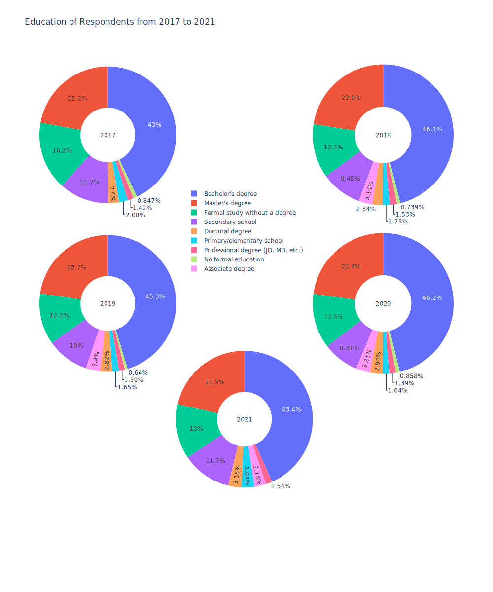
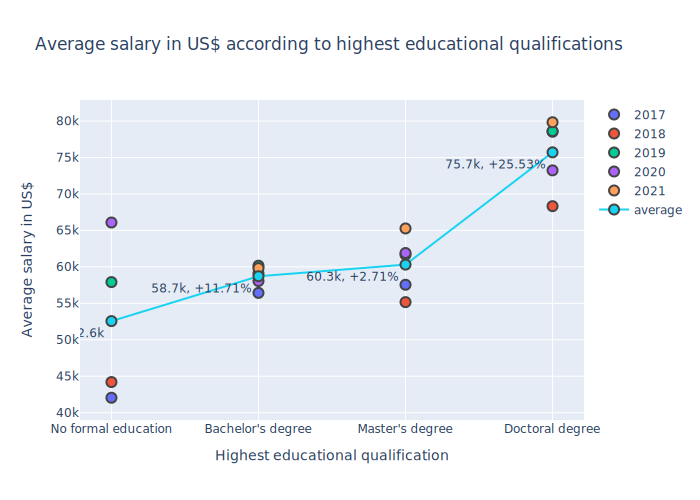
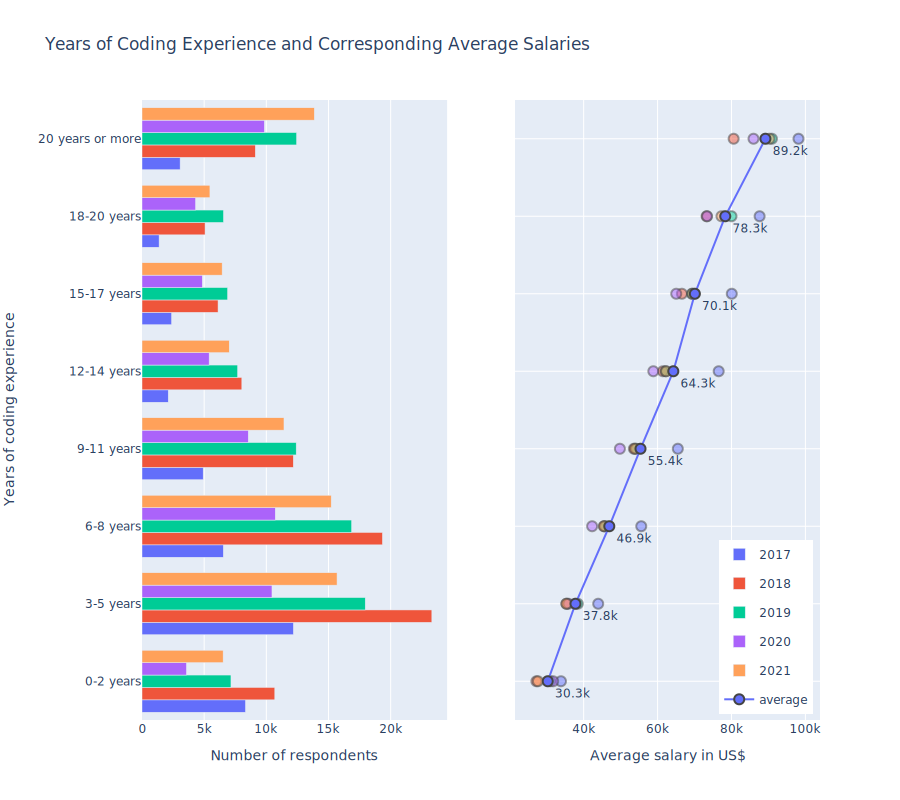

# DeveloperSurvey

## Stack Overflow Developer Survey Results

StackOverflow is a popular forum for software developers, students, and anyone who deals with programming, in a context for professional work or education. The website conducts annual surveys of its users, which gathers data about respondents in terms of their employment status, work experience, technology usage, along with personal details, such as age, gender, sexuality etc. This data is published online and can be accessed by anyone freely. It provides valuable insights into the workers in the technology sector, as well as people who wish to be employed in this sector in the future or have been in the past. Data from 2017 to 2021 has been used in this project. Below are some graphs and charts which help to display the data in the responses.

### Age
This bar plot shows the distribution of ages of the respondents.

### Salary
This plot shows the distribution of annual salaries in US$ of the respondents.

### Education
This chart shows the highest educational qualifications of the respondents from 2017 to 2021. In every year, respondents with a bachelor's degree make up a clear plurality of respondents, followed by respondents with master's degrees and with no formal qualifications.

This plot shows the average salaries of respondents corresponding to particular educational qualifications. A clear increase in average salary can be seen while going from respondents with no formal educational qualifications to respondents with bachelor's degrees (+11.71%), and also going from master's degrees and doctorate degrees (+25.53%).

### Coding Experience

The chart below shows the distribution of respondents with years of experience in professional coding (left), along with the average salary in each of those groups of respondents (right)

